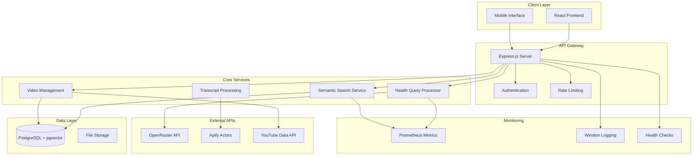
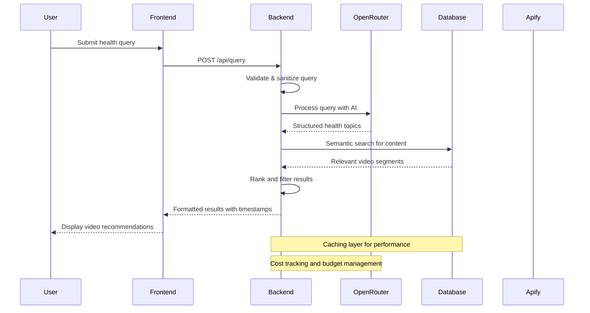
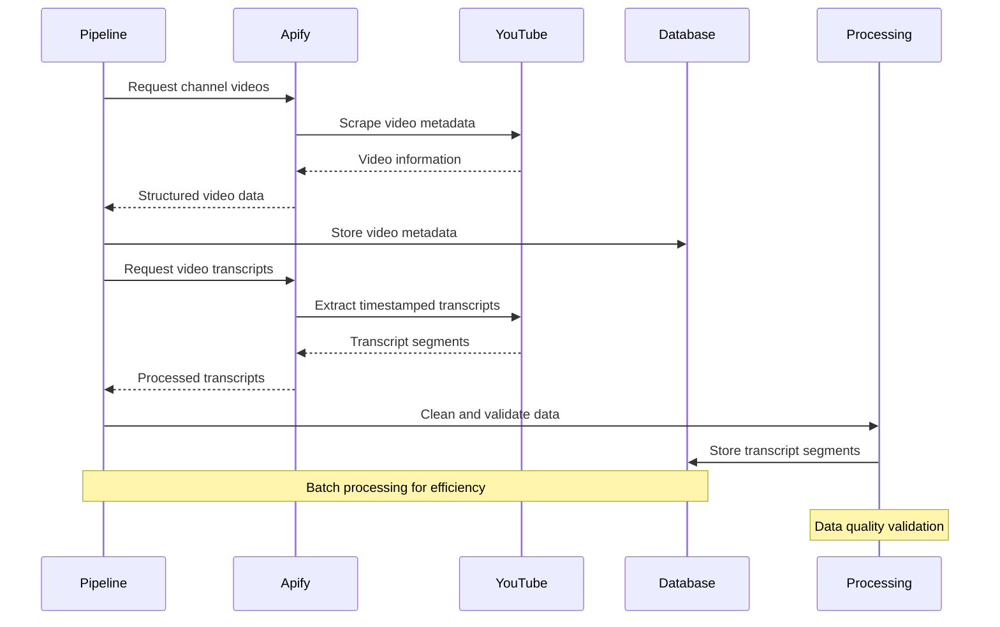

# Technical Architecture - Huberman Health AI Assistant

## 🏗️ System Overview

The Huberman Health AI Assistant is a sophisticated health information retrieval system that leverages AI-powered semantic search to help users find relevant content from Dr. Andrew Huberman's podcast library. The system processes natural language health queries and returns timestamped video segments with high relevance scores.

## 🎯 Core Objectives

1. **Accurate Health Information Retrieval**: Find precise moments in Huberman Lab podcasts relevant to user health queries
2. **Cost-Efficient AI Processing**: Minimize AI API costs while maintaining high-quality results
3. **Scalable Architecture**: Support growing content library and user base
4. **Responsible Health Information**: Provide appropriate disclaimers and context for health content

## 🏛️ System Architecture

### High-Level Architecture



### Component Relationships

#### Frontend Layer
- **Technology**: React 19 + TypeScript + Vite
- **Responsibilities**: User interface, query input, results display
- **Communication**: RESTful API calls to backend
- **State Management**: React hooks and context

#### Backend Layer
- **Technology**: Node.js + Express.js + MCP Protocol
- **Responsibilities**: API orchestration, business logic, data processing
- **Architecture Pattern**: Service-oriented architecture with dependency injection
- **Communication**: HTTP REST API, database connections

#### Data Layer
- **Primary Database**: PostgreSQL with pgvector extension
- **Vector Storage**: Embeddings for semantic search
- **File Storage**: Logs, temporary files, cached data
- **Backup Strategy**: Automated database backups

## 🔄 Data Flow Architecture

### Query Processing Flow



### Data Collection Flow



## 🛠️ Technology Stack Deep Dive

### Frontend Technologies

| Technology | Version | Purpose | Justification |
|------------|---------|---------|---------------|
| React | 19.x | UI Framework | Latest features, concurrent rendering |
| TypeScript | 5.x | Type Safety | Better developer experience, fewer bugs |
| Vite | 5.x | Build Tool | Fast development, optimized builds |
| Tailwind CSS | 3.x | Styling | Utility-first, responsive design |
| Framer Motion | 11.x | Animations | Smooth user interactions |

### Backend Technologies

| Technology | Version | Purpose | Justification |
|------------|---------|---------|---------------|
| Node.js | 20.x | Runtime | JavaScript ecosystem, async I/O |
| Express.js | 4.x | Web Framework | Mature, flexible, extensive middleware |
| PostgreSQL | 15.x | Database | ACID compliance, JSON support |
| pgvector | 0.5.x | Vector Search | Efficient similarity search |
| Winston | 3.x | Logging | Structured logging, multiple transports |

### AI & External Services

| Service | Purpose | Cost Model | Performance |
|---------|---------|------------|-------------|
| OpenRouter | AI Processing | Pay-per-token | ~$0.0001 per query |
| Apify | Data Scraping | Pay-per-run | ~$0.01 per video |
| YouTube Data API | Video Metadata | Quota-based | 10,000 requests/day |

## 🔍 Database Schema

### Core Tables

```sql
-- Videos table
CREATE TABLE videos (
    id UUID PRIMARY KEY DEFAULT gen_random_uuid(),
    youtube_id VARCHAR(20) UNIQUE NOT NULL,
    title TEXT NOT NULL,
    description TEXT,
    duration_seconds INTEGER,
    view_count BIGINT,
    published_at TIMESTAMP WITH TIME ZONE,
    thumbnail_url TEXT,
    created_at TIMESTAMP WITH TIME ZONE DEFAULT NOW(),
    updated_at TIMESTAMP WITH TIME ZONE DEFAULT NOW()
);

-- Transcript segments table
CREATE TABLE transcript_segments (
    id UUID PRIMARY KEY DEFAULT gen_random_uuid(),
    video_id UUID REFERENCES videos(id) ON DELETE CASCADE,
    start_time DECIMAL(10,3) NOT NULL,
    end_time DECIMAL(10,3) NOT NULL,
    text TEXT NOT NULL,
    segment_index INTEGER NOT NULL,
    embedding vector(1536), -- OpenAI embedding dimension
    created_at TIMESTAMP WITH TIME ZONE DEFAULT NOW()
);

-- Health topics table
CREATE TABLE health_topics (
    id UUID PRIMARY KEY DEFAULT gen_random_uuid(),
    name VARCHAR(255) UNIQUE NOT NULL,
    category VARCHAR(100),
    description TEXT,
    keywords TEXT[],
    created_at TIMESTAMP WITH TIME ZONE DEFAULT NOW()
);

-- Query logs table
CREATE TABLE query_logs (
    id UUID PRIMARY KEY DEFAULT gen_random_uuid(),
    query_text TEXT NOT NULL,
    processed_query JSONB,
    results_count INTEGER,
    processing_time_ms INTEGER,
    cost_usd DECIMAL(10,6),
    created_at TIMESTAMP WITH TIME ZONE DEFAULT NOW()
);
```

### Indexes for Performance

```sql
-- Vector similarity search
CREATE INDEX idx_transcript_segments_embedding 
ON transcript_segments USING ivfflat (embedding vector_cosine_ops);

-- Time-based queries
CREATE INDEX idx_transcript_segments_time 
ON transcript_segments (video_id, start_time);

-- Text search
CREATE INDEX idx_transcript_segments_text 
ON transcript_segments USING gin(to_tsvector('english', text));

-- Video lookups
CREATE INDEX idx_videos_youtube_id ON videos (youtube_id);
CREATE INDEX idx_videos_published_at ON videos (published_at DESC);
```

## 🚀 Performance Characteristics

### Response Time Targets

| Operation | Target | Actual | Notes |
|-----------|--------|--------|-------|
| Health Query | < 3s | ~2.1s | Including AI processing |
| Semantic Search | < 1s | ~0.8s | Database vector search |
| Video Metadata | < 500ms | ~200ms | Cached responses |
| Transcript Segments | < 1s | ~0.6s | Indexed queries |

### Throughput Metrics

| Metric | Current | Target | Scaling Strategy |
|--------|---------|--------|------------------|
| Concurrent Users | 50 | 500 | Horizontal scaling |
| Queries/minute | 100 | 1000 | Caching, optimization |
| Data Processing | 10 videos/min | 100 videos/min | Parallel processing |

### Resource Usage

| Resource | Development | Production | Scaling Notes |
|----------|-------------|------------|---------------|
| Memory | 200MB | 1GB | Linear with concurrent users |
| CPU | 10% | 40% | Spikes during AI processing |
| Storage | 500MB | 10GB | Grows with content library |
| Network | 1MB/s | 10MB/s | Video streaming bandwidth |

## 🔒 Security Architecture

### Authentication & Authorization
- **Current**: No authentication (public access)
- **Planned**: JWT-based authentication for user accounts
- **API Security**: Rate limiting, input validation, CORS protection

### Data Protection
- **Encryption**: TLS 1.3 for data in transit
- **Database**: Connection encryption, access controls
- **API Keys**: Environment variables, secure storage
- **Logging**: No sensitive data in logs

### Privacy Considerations
- **User Queries**: Not stored permanently (configurable)
- **Analytics**: Aggregated metrics only
- **Health Data**: Appropriate disclaimers, no medical advice

## 📊 Monitoring & Observability

### Metrics Collection
- **Application Metrics**: Response times, error rates, throughput
- **Business Metrics**: Query success rate, user satisfaction
- **Infrastructure Metrics**: CPU, memory, disk usage
- **Cost Metrics**: AI API usage, infrastructure costs

### Logging Strategy
- **Structured Logging**: JSON format with consistent fields
- **Log Levels**: ERROR, WARN, INFO, DEBUG
- **Retention**: 30 days for application logs
- **Monitoring**: Real-time error alerting

### Health Checks
- **Endpoint**: `/api/health`
- **Checks**: Database connectivity, external API status
- **Response Format**: JSON with service status details
- **Monitoring**: Automated health check monitoring

## 🔄 Deployment Architecture

### Development Environment
- **Local Development**: Docker Compose for full stack
- **Database**: PostgreSQL container with sample data
- **External APIs**: Development keys with rate limits

### Production Environment
- **Container Orchestration**: Docker containers
- **Database**: Managed PostgreSQL with backups
- **Load Balancing**: Application-level load balancing
- **CDN**: Static asset delivery optimization

### CI/CD Pipeline
- **Source Control**: Git with feature branches
- **Testing**: Automated unit and integration tests
- **Deployment**: Automated deployment on merge
- **Rollback**: Quick rollback capability for issues

## 🔮 Future Architecture Considerations

### Scalability Improvements
- **Microservices**: Split monolithic backend into services
- **Caching Layer**: Redis for frequently accessed data
- **Message Queue**: Async processing for heavy operations
- **CDN**: Global content delivery network

### AI/ML Enhancements
- **Local Models**: Reduce external API dependencies
- **Fine-tuning**: Custom models for health domain
- **Embeddings**: Improved semantic search accuracy
- **Personalization**: User-specific recommendations

### Data Pipeline Evolution
- **Real-time Processing**: Stream processing for new content
- **Data Quality**: Automated quality assurance
- **Multi-source**: Additional health content sources
- **Versioning**: Content version management
